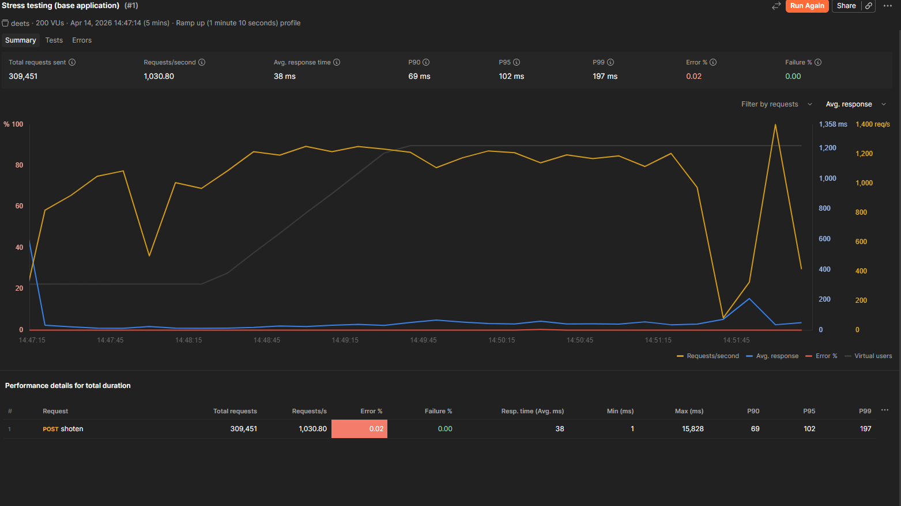
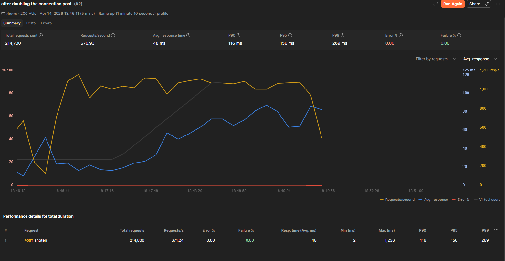
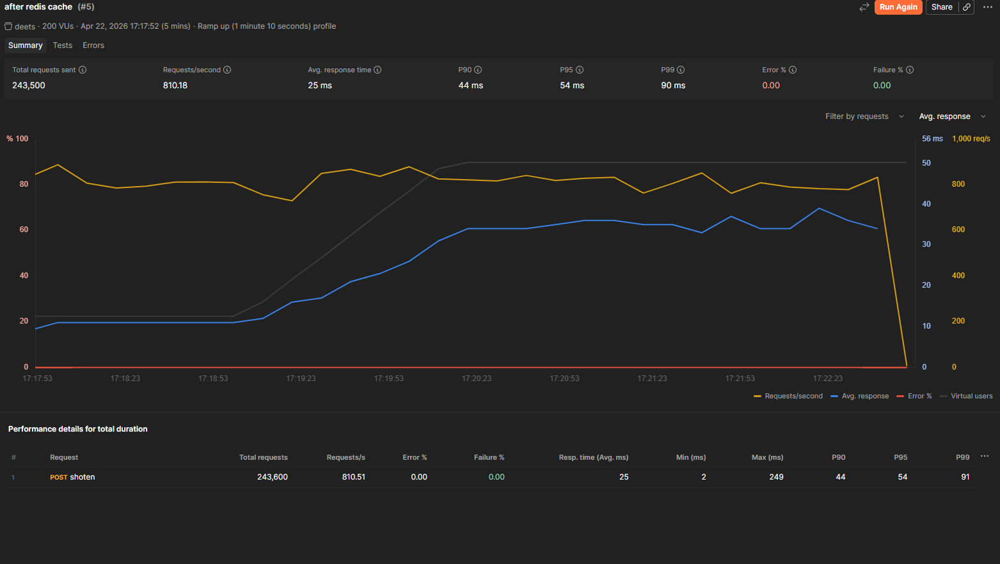

# Deets

A high-performance URL Shortener built using Spring Boot. This service converts long URLs into short, shareable links and efficiently redirects users to the original destination.

---

# Features

- Shorten long URLs into compact, unique codes
- Redirect short URLs to original URLs
- RESTful API design
- High-performance and scalable architecture
- Logging and monitoring support
- update url code

---

#  Tech Stack

- Spring Boot
- Spring Web
- Spring Data JPA
- PostgreSQL
- Jedis
- Docker

---
# Startup

To start the application, ensure the Docker daemon is running in the background and then execute the following steps:

1. **Verify Docker is running**  
   Make sure the Docker daemon is active so that the application can spin up the required containers automatically during startup.

2. **Make sure to change the DB Username & Password in application.properties file**

3. **Run the Spring Boot application**  
   From the project root directory, execute the Maven command:
   ```bash
   mvn spring-boot:run
   ```  
   This will automatically start the necessary Docker containers (via Docker Compose) and launch the Spring Boot application on the default port (usually `8080`).

---

# What I Added and Why

This section explains the key additions I’ve made and the reasoning behind them.

### 1. Key generator service for 8‑character keys

- I introduced a dedicated **key generator service** that produces short, unique keys of exactly **8 characters**.
- It generates compact, human‑readable keys (for example, used as URL slugs or short identifiers) with a fixed length of 8 characters.

--- 
### 2. Retry mechanism on key collision

I added a **retry mechanism** that attempts to generate a new key up to **10 times** if a collision (duplicate key) is detected.

**What this does:**
- After generating a key, the system checks whether that key already exists in the database or storage.
- If a collision is found, it regenerates the key and repeats this check, up to a maximum of **10 retries**.
- If all 10 attempts result in collisions, the flow fails explicitly, rather than looping indefinitely.

**Why I added this:**
- Relying only on uniform randomness for 8‑character keys becomes riskier as the system scales, so a small number of retries helps absorb minor collision spikes without rejecting valid requests immediately.
- Setting a **hard limit of 10 retries** prevents the system from getting stuck in an infinite or long‑running retry loop, which could degrade performance or cause timeouts.
---
### 3. Redis caching with Jedis

I added **Jedis** as the Redis client to implement caching for URLs, using a `RedisService` that wraps basic `get`, `set`, and `delete` operations.

For example:
- `getUrlByCode`, `getUrlById`, and `getUrlByLongUrl` first check Redis and fall back to the database if the key is not present.
- When a URL is created or updated, the old cache entries are deleted so that subsequent reads return fresh data.

**Why I added this:**
- Caching frequently accessed URLs in Redis **reduces database load** and improves read‑latency for short‑URL lookups.
- Using Jedis gives a lightweight, synchronous Redis client that integrates cleanly with Spring and is easy to reason about in a simple URL‑shortening service like this.
- ---

### 4. Connection pooling with Hikari

I configured the application to use Hikari as the connection pool for database access, with the following characteristics:

- The pool keeps at least 5 connections ready at all times, so new requests can quickly borrow a connection instead of waiting for one to be created.
- The maximum number of connections allowed at any moment is capped at 20, which helps prevent the database from being overloaded while still supporting decent concurrency.
- If no connection is available within 30 seconds, the request will time out, giving fast feedback instead of hanging indefinitely.
- Connections that have been idle for more than 10 minutes or have been alive for more than 30 minutes are retired and replaced, which helps avoid stale or broken connections and keeps the pool healthy over long uptimes.

---

### 5. Actuator endpoints for health and metrics

I enabled Spring Boot’s built‑in Actuator endpoints to support monitoring and observability:

- The health endpoint is turned on so that external systems can check whether the application is up and its dependencies (such as the database) are reachable.
- The exposure configuration allows both the health and metrics endpoints to be reachable over HTTP, so they can be used by monitoring tools or dashboards.

---
# Stress Testing Results

To evaluate performance improvements, the application was stress-tested at three key stages of development:

1. **Base Application (Initial)**
2. **After Connection Pooling**
3. **After Adding Redis Cache**

Each test was executed with ~200 virtual users over 5 minutes with ramp-up.

---

### 1. Base Application (Initial)



**Key Metrics:**
- Requests/sec: **~1030**
- Avg Response Time: **38 ms**
- P90: **69 ms**
- P95: **102 ms**
- P99: **197 ms**
- Error Rate: **0.02%**

**Observation:**
- Good throughput but noticeable latency spikes (max latency ~15s).
- 50 failed requests due to db not accepting anymore connections.

---

### 2. After Connection Pooling



**Key Metrics:**
- Requests/sec: **~670**
- Avg Response Time: **48 ms**
- P90: **116 ms**
- P95: **156 ms**
- P99: **269 ms**
- Error Rate: **0%**

**Observation:**
- System stability improved (zero errors).
- Throughput dropped and latency increased.

---

### 3. After Adding Redis Cache



**Key Metrics:**
- Requests/sec: **~810**
- Avg Response Time: **25 ms**
- P90: **44 ms**
- P95: **54 ms**
- P99: **90 ms**
- Error Rate: **0%**

**Observation:**
- Significant improvement in latency across all percentiles.
- Much more stable and predictable response times.
- Redis reduced repeated database reads → lower DB pressure.
- Best trade-off between throughput and latency so far.

---

## 📊 Summary Comparison

| Stage               | Requests/sec | Avg (ms) | P95 (ms) | P99 (ms) | Error % |
|--------------------|------------:|---------:|---------:|---------:|--------:|
| Base App           | 1030        | 38       | 102      | 197      | 0.02%   |
| Connection Pooling | 670         | 48       | 156      | 269      | 0%      |
| Redis Cache        | 810         | 25       | 54       | 90       | 0%      |


## Future Scope
- Custom alias support (POST /api/urls with optional customCode)
- Link expiration (expire at timestamp or after N days)
- Click analytics (total clicks, last accessed, basic referrer/user-agent stats)
- Rate limiting + abuse protection (per IP/API key, especially for shorten endpoint)
- Soft delete / disable link (keep record but stop redirects)
- User/API key ownership (each link belongs to a user or client key)
- QR code endpoint for each short URL
- Bulk URL shortening (upload/list input, batched response)
- Health + readiness + deeper metrics (DB/Redis latency, cache hit ratio)
- OpenAPI/Swagger docs